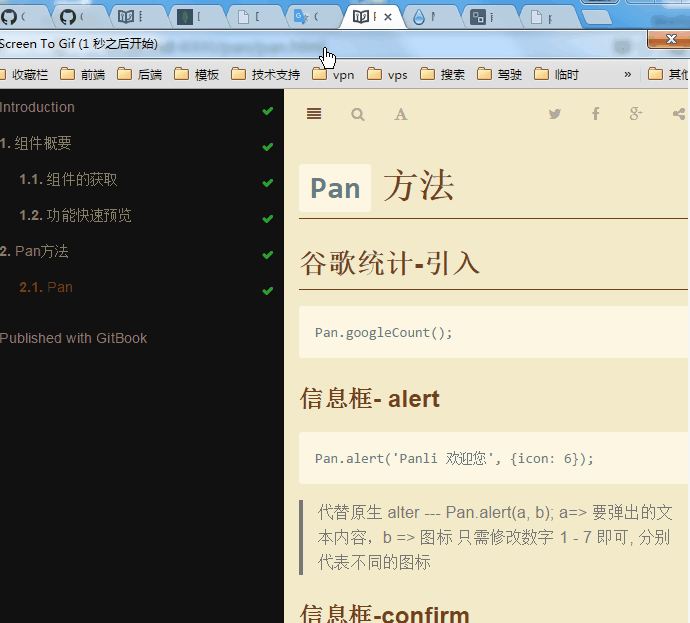

#Panli 组件使用入门

> 这本是 PC (非移动设备) 端的 如果想查看 移动端的 请 [点击这里](http://blog.zanjs.com/ "移动端入门")

本书为初级难度，适合入门JavaScript语言基础的读者，用来了解这门语言的最新发展；也可当作参考手册，查寻新增的语法点。

##本书制作

本书采用 `gitbook` 制作 由 `Markdown` 书写

## 阅读帮助

您可以使用 上下左右键来 享受阅读的体验

>左右键分别是 上一篇 和 下一篇

阅读主题 分为 White(白色) ，Sepia(褐色) 和 Night(夜晚深色) 您还可以设置字体的大小调整 . 如下图

## 分享喜悦

<video id="video" controls="" preload="none" poster="http://media.w3.org/2010/05/sintel/poster.png">
      <source id="mp4" src="http://media.w3.org/2010/05/sintel/trailer.mp4" type="video/mp4">
      <source id="webm" src="http://media.w3.org/2010/05/sintel/trailer.webm" type="video/webm">
      <source id="ogv" src="http://media.w3.org/2010/05/sintel/trailer.ogv" type="video/ogg">
      
您的用户代理不支持HTML5视频元素.

</video>
