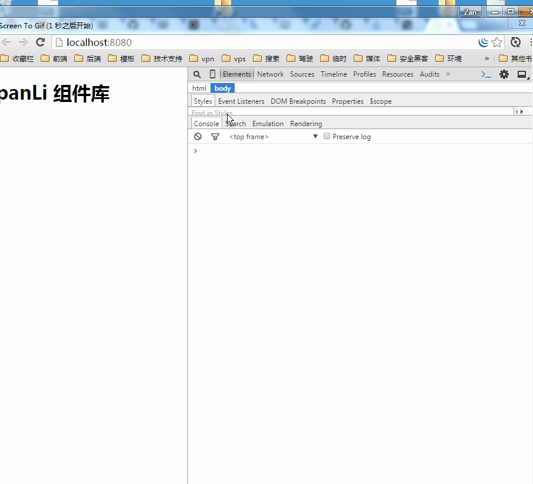

## 功能快速预览

###  `P` 方法

 大 `P` 方法 是的组件不在需要 `jQuey` 当您在使用 `jQuey` 的 `$` 方法的时候 ，现在都可以用 `P` 方法了 ，
 因为在 `panli.min.js`  里面 已经分装了 大部分 `jQuey` 的方法;

  大 `P` 方法 主要是用于操作 DOM 的 ，如果你了解 `jQuey` ，那么您可以很容易上手 `panli.min.js`

 > 这里需要注意的是 是严格区分大小写的 ，请小伙伴们不要打错了

### `Pan` 方法

`Pan` 方法 首字母要大写哦 ，`Pan` 方法  主要用于 公共的组件的 生产 ，比如你要弹出一个 对话框 ，如下图：
`Pan` 方法 还可以动态引入一些 常用的方法，比如谷歌统计代码 ：我们不需要在页面写一大堆丑陋的代码，
我们只需要优雅在页面底部 (footer) 调用一下 `Pan.googleCount` 即可,当然这只是一小部分，还有更多值得我们去探索的，
加油吧 ！小伙伴！

